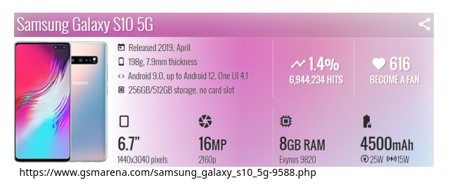

# Sejarah Perkembangan Perangkat Mobile

## Teknologi 0G (Zero Generation)

Generasi awal (0G) atau *Mobile* radio telepon ini merupakan teknologi telepon selular modern permulaan, dimana menggunakan jaringan gelombang radio (radiotelephone) khusus terpisah dan tertutup dengan jaringan lain yang sejenis) dengan jangkauan jaringan yang terbatas dan dapat terhubung dengan jaringan telepon umum biasa.

Dipergunakan biasa pada mobid dan truk agar dapat berkomunikasi deengan jaringan telepon biasa

### Kemampuan Teknologi 0G:

- Dapat melayani komunikasi suara saja
- Merupakan teknologi awal komunikasi bergerak
  
### Kelemahan Teknologi 0g:

- Jumlah pelanggan dan jangkauan jaringannya sangat terbatas
- Tidak mendukung komunikasi data

### Contoh

## Teknologi 1G (Generasi Pertama)

Generasi pertama atau 1G merupakan teknologi handphone pertama yang diperkenalkan pada era 80-an dan masih menggungakan sistem analog

teknologi tersebut menggunakan teknik komuikasi disebut _Frequency Division Multiple Access_ (FDMA)

### Kemampuan Teknologi 1G:

Kemampuan teknologi 1G ini hanya dapat melayani komunikasi suara saja, tidak dapat melayani komunikasi data, akan tetapi jangkauan jaringannya lebih luas

### Contoh

## Teknologi 2G (Generasi Kedua)

Teknologi generasi kedua muncul pada awal tahun 90-an karena tuntutan pasar dan kebutuhan akan kualitas yang semakin baik. Generasi 2G sudah menggunakan teknologi digital

### Kemampuan teknologi 2G:

- Penggunaan sinyal digital memperlengkapi telepon selular dengan pesan suara, panggilan tunggu, dan SMS. Telepon selular pada generasi ini juga memiliki ukuran yang lebih kecil karena menggunakan chip digital
- 2G memiliki kapasitas lebih besar daripada 1G
- Suara yang dihasilkan menjadi lebih jernih
  
### Contoh

## Teknologi 3G (Generasi Ketiga)

### Kemampuan 3G:

- Generasi ini disebut juga 3G karena memungkinkan operator jaringan untuk memberi pengguna mereka jangkuan yang lebih luas.
- Mulai dimasukkannya sistem operasi pada handphone.
- Mengadakan fitur _high-speed data access_ sehingga memungkinkan tersedianya layanan-layanan yang dapak dinikmati oleh pengguna melalui ponselnya

### Contoh

## Teknologi 4G (Generasi Keempat)

### Kemampuan 4G:

- Bisa mengintergrasikan (pembauran hingga menjadi kesatuan yang utuh) teknologi _wireless_
- Memberikan penggunanya kecepatan tinggi, volume tinggi, kualitas baik, jangkauan global, dan fleksibilitas untuk menjelajahi berbagai teknologi berbeda
- Memberikan pelayanan pengiriman data cepat (jaringan yang cepat)

### Contoh

## Teknologi 5G (Generasi Kelima)

Generasi kelima dari teknologi seluler nirkabel ini menawarkan kecepatan unggah dan unduh yang lebih tinggi, koneksi yang lebih konsisten, dan peningkatan kapasitas dibandingkan jaringan sebelumnya.

### Contoh

# Pemrograman Mobile

Pemrograman mobile bukan hanya tentang membangun aplikasi telepon. Tetapi semua pengembangan untuk segala jenis perangkat mobile, seperti tablet, ponsel, dan perangkat lainnya. **Pemrograman tersebut harus flexible terhadap perangkat lainnya**

Tidak hanya pengembangan aplikasi mobile saja, karena harus memikirkan bagaimana aplikasi tersebut akan dapat digunakan dan diakses ataupun dapat dioperasikan pada perangkat mobile yang ada

# Sistem Operasi Perangkat Mobile

Setiap perangkat mobile harus memiliki sistem operasi karena hal tersebut berfungsi sebagai pengelola sumber daya perangkat dan penyediaan layanan supaya bisa mengkases aplikasi yang ada

Sistem operasi pada perangkat mobile memadukan kemampuan sistem  operasi pada komputer dengan kemampuan untuk mengelola komponen yang biasa ada dalam perangkat mobile seperti layar sentuh, jaringan seluler, bluetooth, WiFi, navigasi GPS, NFC, dan fitur standar lainnya. Jadi  sistem operasi perangkat bergerak memiliki kelebihan dalam mengelola  secara langsung hardware yang disertakan.

## Kelebihan Sistem Operasi Mobile

- Bisa melakukan lebih daripada telepon, terdapat perangkat keras yang lebih tinggi seperti RAM, prosesor dan sebagainya
- Menyediakan fungsi yang lebih banyak dan lebih maju serta internet yang dapat berkerja lebih baik pada sistem operasi mobile
  
## Kelemahan

- Memerlukan daya baterai yang dimana pengunaannya terbatas

# Platform OS Mobile

- Platform populer
  - iOS
  - Android
  - Windows Phone
- Platform lain (discontinued)
  - Symbian
  - Blackberry
  - Firefox OS
  - Ubuntu Touch

## Berikut Beberapa OS dan Penejasannya

1. Windows Phone
    
   
2. Windows 10 Mobile
    
   
3. iOS
    
   
4. Android
    
   

# Arsitek Sistem Operasi Mobile Android

Arsitektur Android terdiri dari berbagai lapisan dan setiap lapisan terdiri dari beberapa program yang memiliki fungsi berbeda

Berikut ini adalah lapisan-lapisan Android:
 

## Linux Kernel

Linux Kernel merupkana Lapisan terbawah dari arsitektur Android. Linux Kernel adalah Penyediaan fungsionalitas sistem operasi ke mobile yang bertanggung jawab atas aplikasi ini. Lapisan ini tidak langsung berinteraksi dengan pengguna maupun developer. Lapisan ini merupakan jantunga dari seluruh sistem. Berikut fungsi-fungsi tersebut:

- Abstraksi Hardware
- Program Manajemen Memory
- Pengaturan Sekuritas
- Manajemen Energi Software (Baterai)
- Driver (Pengontrol Hardware)
- Network Stack

## Library

Library membawa sekumpulan instruksi untuk mengarahkan perangkat Android dalam menangani tipe data, seperti format video dan Audio ditangani oleh Media Framework library. Berikut adalah beberapa kegunaan library:

- Surface Manager : Mengolah tampilan Windows pada layar
- SGL : Grafik 2 dimensi
- Open GL|ES : Grafik 3 dimensi maupun 2 Dimensi
- Media Framework : Menunjang perekaman dari berbagai macam format audio, vidio, dan gambar
- Free Type : Penerjemah font
- WebKit : Mesin browser
- libc : System C libraries
- SQLite : Database
- Open SSL : Sekuritas jaringan
  

## Android Runtime

Android adalah mesin yang menggerakkan aplikasi kita bersama dengan libraries dan membentuk dasar untuk framework aplikasi. Android Runtime menyediakan komponen utama yaitu Dalvik Virtual Machine (DVM)

DVM adalah sejenis Java Virtual Machine yang dirancang dan dioptimalkan khusus untuk Andorid. DVM menggunakan fitur inti linux seperti manajemen memory dan multi-threading. DVM membuat Aplikasi Android dapat berjalan dengan prosesnya sendiri

## Application Framework

Lapisan ini berinteraksi langsung dengan aplikasi kita. Layer Application Framework menyediakan class dan interface untuk Pengembangan aplikasi Android dan services ke aplikasi dalam bentuk class Java.

Beberapa program penting pada Application Framework antara lain:

- **Activity Manager** - Mengotrolsemua aspek dari siklus hidup aplikasi dan activity stack
- **Contect Providers** - Mengiizinkan aplikasi untuk mempublikasikan dan berbgai data dengan aplikasi lainnya
- **Resource Manager** - Memberi akses kepada resources yang bukan kode seperti strings, setting warna, dan layout User Interface
- **Notifications Manager** - Membuat aplikasi dapat menampilkan pengingat dan notifikasi kepada pengguna
- **View System** - Digunakan untuk membuat User Interface aplikasi

## Application

lapisan ini untuk berfungsi untuk menelepon, mengakses website, dll. Developer dapat membuat aplikasinya untuk diinstal pada lapisan ini (mempublish aplikasinya)

Beberapa aplikasi standar yang pasti ada pada setiap perangkat, seperti:

- Aplikasi SMS
- Kalender
- Web Browser
- Contact Manager